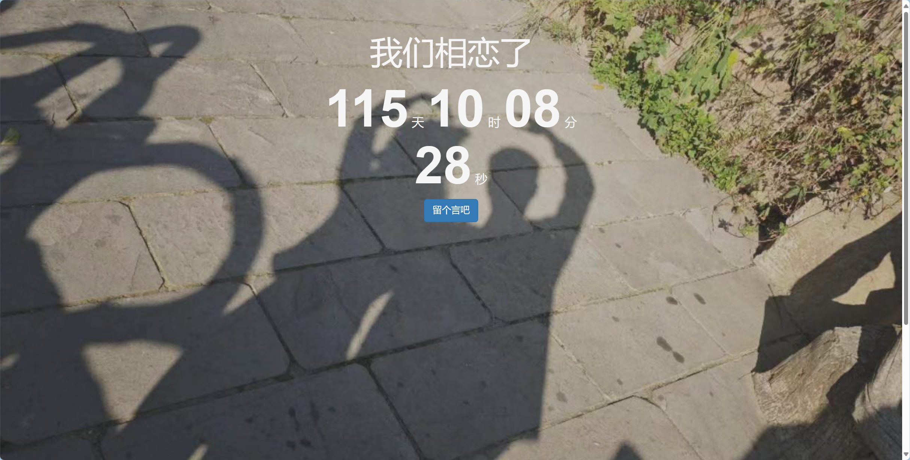

# 恋爱计时HTML&&日记留言

## 1.效果展示

## 2.特点

1. 背景图片随机更换
2. 留言的时候可以选择上传一张图片，作为当前心情的说明，默认使用imgs/we/default.jpg

## 3.使用方法
### 1.开启自启动后台服务
windows创建快捷方式，开启自启动后台服务：

右键点击`watch_start.vbs`文件，然后选择“创建快捷方式”（win11点击显示更多找到相对的选项）。
将快捷方式移动到启动文件夹：

按下 Win + R 组合键打开“运行”对话框。
输入 shell:startup，然后按 Enter 键。这会打开启动文件夹。
将你创建的 `watch_start.vbs` 文件的快捷方式拖放到启动文件夹中。
### 2.创建桌面快捷方法
右键点击`恋爱记时&&日记留言.html`，发送到桌面快捷方法或者创建快捷方法后拖到桌面
右键点击`恋爱记时&&日记留言.html`的快捷方法属性-->更改图标-->输入 love.ico图片（在项目文件内）地址后确定-->选择love.ico
##### 3.其它
起始时间请在`恋爱记时&&日记留言.html`中的计时器模块自行修改。 73行，按照相应格式修改
其它的图片想替换请自己替换，要保证文件名一致  可替换图片路径 imgs/we/*.jpg 注意替换的图片不一定要一样，笔者懒得改所有t1~t9是一样的图片，每次刷新界面会加载不一样的图片的
